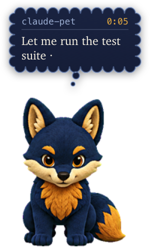
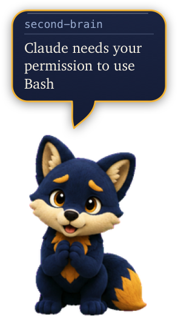
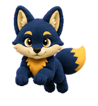

# Mikkel

A desktop pet for macOS that reacts to what Claude Code is doing. Mikkel is the
navy-and-gold arctic fox hatched with the Codex `hatch-pet` skill, reusing that
spritesheet and driving it from Claude Code's hook system instead.

<p align="center">
  
  &nbsp;&nbsp;&nbsp;
  
</p>

## What he does

He sits on the desktop above other windows and changes animation as Claude Code
works:

| | | | | | | |
|:--:|:--:|:--:|:--:|:--:|:--:|:--:|
|  |  |  |  |  |  |  |
| idle | working | inspecting | asking | subagent done | something broke | asleep |

| Claude Code is doing            | Mikkel        |
| ------------------------------- | ------------- |
| starting a session              | waves         |
| thinking, or running most tools | works         |
| reading, searching, fetching    | inspects      |
| waiting for you to approve      | asks          |
| a tool failed                   | looks sad     |
| a subagent finished             | jumps         |
| nothing                         | idles         |

## What he says

The bubble never shows a tool name. "Bash: Stack the two bubble captures" is a
log line, not a pet: `Bash` is machinery, and the text after it is the private
description Claude writes for itself in the imperative. Mikkel speaks in the
first person instead, so that becomes "Let me stack the two bubble captures".

Each tool gets its own phrasing, drawn from a small set of variants chosen by a
stable hash of the subject. Stable matters: the wording must not change while
one tool call is still running, and Swift's own hashing is seeded per process,
so `Phrasebook` carries its own.

| Claude is doing        | Mikkel says                     |
| ---------------------- | ------------------------------- |
| reading a file         | Let me look at Atlas.swift      |
| searching              | Hunting for socketPath          |
| editing                | Tidying up PetView.swift        |
| running a command      | Let me run the test suite       |
| asking permission      | Claude's own wording, verbatim  |
| a tool failed          | That didn't go through          |

An approval prompt keeps Claude's own message, because it says what is actually
being asked better than anything of ours would.

He gets two balloons, and which one appears says what is happening before a
word of it is read. While he is working he **thinks**: a scalloped cloud with
two little bubbles trailing down to him. When he is addressing you — asking for
something, reporting a failure, saying he is done — he **speaks**, and the
cloud becomes a balloon with a hooked tail. The tail is walked as part of the
outline rather than dropped in behind it, so nothing is stroked across it, and
it leans off centre because a tail on a plumb line is a tooltip arrow.

The balloon inflates out of its own tail on a spring rather than fading in on
the spot, and deflates back the same way. Its fill is a lit gradient over a
soft shadow, so it floats above the desktop instead of lying flat on it.

Type is Charter for what he says and Menlo for the labels around it: a book
serif for the sentence, a terminal mono for the machine's own words, which is
the whole of what he does. Both ship with macOS, so nothing is bundled.

The balloon sizes itself to the text, so "All done" gets a small one rather
than the same slab as a full sentence. It is never wider than Mikkel himself: a
long line wraps downward instead, up to four lines, and truncates past that. A
balloon wider than the pet stops reading as something he is saying.

A header names the session the line came from, taken from that session's
working directory, so two Claude Code windows are told apart without opening
the menu. It uses the same wording the menu does, and falls back to "session"
for a session with no directory. Dots cycle while he is busy, and a clock fades
in beside the session name once a job passes four seconds, so a slow build is
visibly slow. The border picks up the state: gold when he needs you, warm red
when something broke, quiet blue otherwise.

## Sleeping

After four minutes with nothing happening he curls up and dozes: no bubble, no
pointer tracking, no animation. He also settles at once when the last Claude
Code session closes, since there is plainly nothing left to watch; closing one
of several does not, and a session that merely falls silent is left to the
timer, because it may still come back. Any event wakes him, and so does
clicking him. The delay is on the menu, or turn it off.

A line that has stopped changing fades after ten seconds, so a finished job
does not leave "All done" on screen indefinitely. Lines that are
still working are exempt, since their dots and clock are visibly live. A faded
bubble counts as empty for sleeping, or he would never settle.

He settles properly rather than cutting: four frames lower him from sitting
into a curl with his eyes closing, then four more breathe. The settle's last
frame and the loop's first are the same drawing, so the handover has no jump.

That sleep row is a twelfth row, one past the eleven the v2 contract defines,
making this atlas 1536x2496. The contract has no sleeping state, and the eleven
rows were full: fourteen cells were free but the longest contiguous run was
four. An atlas that stops at eleven rows still loads, and falls back to a still
closed-eye pose. Keep `~/.codex/pets/mikkel` at eleven rows, since Codex itself
rejects anything taller.

Finishing a turn is rest, not a request. Claude Code notifies both when it needs
a decision and when it has simply finished and is waiting, and treating the
second as a request left him asking for input after the work was already done.

## Jumping

The contract gives jumping five frames. This atlas uses all eight, for a proper
arc: settle, crouch, launch, rise, peak, fall, land, recover. Frames 0 and 7 are
the same grounded pose, so it starts and ends where it began. The timing is
quick through the air and slower at either end, which gives the leap some snap.

## Two playback modes

The states he sits in while Claude works, idle, working, inspecting and asking,
do not run as flipbooks. Nor does the sad reaction to a failure. Flipping six poses a second reads as frantic when it
lasts for minutes. Instead he holds one pose for a few seconds, then cuts to
another at random, never repeating the pose he is already in.

The hold length is not uniform. About a third of the time he shifts quickly, the
way an animal glances up mid-rest; otherwise he settles. Measured over 30
seconds at the default Pace: twelve changes, from 1.0 to 4.5 seconds, averaging
2.7. A single fixed interval read as metronomic.

Locomotion and the motion one-shots, waving and jumping, still run as real
animations. Those are over in half a second and there the movement is the whole
point.

The sad reaction used to be one of them, and it was wrong. Its eight cells are
eight ways of looking glum rather than eight steps of a movement, so running
them in order cycled the lot in about a second and read as panic instead of
disappointment. It holds them now, like the working states. Because a held
reaction has no frames to run out of, it ends on a clock instead: seven seconds,
long enough to settle on a few poses and short enough that he is himself again
before the bubble fades.

Two things keep him calm. He holds each pose for at least 0.6 seconds, because a
busy turn can publish a dozen state changes a second and without that floor he
strobes instead of reading as activity. And every frame duration is stretched by
the Pace setting, which defaults to 1.7x the atlas's own timings. Pace scales
both the animated frames and the held poses, and offers Lively, Steady, Relaxed
and Calm in the menu. At the default, a held pose lasts between 2.7 and 4.8
seconds.

A finished tool no longer resets the pose either. Claude is still busy after a
tool returns, so the pose set when the tool started stands until the next tool
or the end of the turn. Without that, a run of reads restarted the animation
twice per file.

When idle he follows the mouse pointer through the atlas's 16 look directions,
and falls back to the idle loop when the pointer is close by. Drag him and he
runs in the direction he is carried. Click him for his description.

Several Claude Code sessions can run at once, so each is tracked separately and
the pet shows whichever most deserves attention. "Waiting for you" outranks
"busy", which outranks "idle". The menu bar lists every live session and shows a
count when there is more than one.

A live session always outranks one that has gone quiet, whatever their states.
Without that rule a session killed while asking for approval kept the top
priority forever and froze the pet on "needs you" while ignoring the window
actually in use.

To watch one window only, right-click the pet or use the menu bar and pick a
session under Follow. Pick "All sessions" to go back. A pinned session releases
the pin when it ends, so the pet never goes permanently blank.

The menu is on the pet as well as the menu bar, because a status icon can be
pushed off a crowded menu bar or hidden behind the notch. Right-click or
control-click him.

He hops when the pointer arrives over him. It fires on arrival rather than on
being over him, so crossing back and forth cannot set him bouncing, and there is
a few seconds' cooldown so a pointer that only passes through on its way
somewhere else does not set him off again immediately. He will not do it while
asleep or while being carried. The hop is read from the polled pointer position
rather than a tracking area, because the app is an accessory and spends its life
inactive, where enter and exit events are a fight. It says nothing about what
Claude is doing, so unlike every other reaction it does not touch the bubble:
the dots keep cycling, the clock keeps running, and a thought cloud stays a
thought cloud. Turn it off with "Hop when you hover" in the menu.

Headless `claude -p` sessions are ignored by default. Hooks that start their own
Claude session, which is what a session-summary Stop hook does, would otherwise
keep the pet permanently busy with work nobody is watching. Interactive sessions
report entrypoint `cli` and headless ones report `sdk-cli`, and the hook helper
forwards that. Turn on "Follow background sessions" in the menu to see them.

## Install

```bash
./bundle.sh                                              # builds ~/Applications/Mikkel.app
open ~/Applications/Mikkel.app
"$HOME/Applications/Mikkel.app/Contents/MacOS/MikkelPet" --install-hooks
```

The hooks can also be toggled from the menu bar. To start him at login, add
Mikkel.app under System Settings, General, Login Items.

Remove the hooks with `--uninstall-hooks`, or from the same menu.

The installed hook records the absolute path of the helper inside the bundle, so
rerun `--install-hooks` after moving Mikkel.app somewhere else.

## How it hooks into Claude Code

`--install-hooks` appends a `mikkel-hook` command to eight events in
`~/.claude/settings.json`: `SessionStart`, `UserPromptSubmit`, `PreToolUse`,
`PostToolUse`, `Notification`, `SubagentStop`, `Stop` and `SessionEnd`.

Entries are appended to the arrays already there, so other hooks keep working,
and the file is backed up before every write.

`mikkel-hook` reads the payload on stdin, sends a small summary to the app over
a Unix datagram socket at `~/.mikkel-pet/pet.sock`, and exits. Datagrams mean it
never waits for a reader, so Claude Code is not slowed down when the pet is
closed. The helper exits 0 on every path, including bad JSON and a missing
socket, because a non-zero `PreToolUse` hook would block the tool call.

Only small identifying strings travel over the socket: the tool name, the tool's
own `description`, a command, a bare filename. File contents and command output
never leave the hook.

## One copy at a time

Launching Mikkel twice used to break him silently: the second copy took over the
socket, the first went deaf, and closing the duplicate left nothing listening at
all. A second copy now probes the socket, finds the first one answering, and
quits instead of taking over. A socket file left behind by a crash still refuses
the probe and is cleaned up as before.

## Detecting failures

Claude Code emits no `PostToolUse` when a tool fails. Confirmed by capturing
real payloads: three `PreToolUse` events against one failing command produced
only two `PostToolUse` events, and the failing call's `tool_use_id` was the one
missing.

So outstanding `tool_use_id`s are tracked per session and reconciled at turn
boundaries, `Stop` and the next `UserPromptSubmit`. Anything still unmatched
failed. Checking only at boundaries is what keeps parallel tool calls from
looking like failures. A tool that instead reports `is_error` in its response
is caught immediately.

Every event above was captured from a live session and checked against the
running pet, except `Notification`, whose text field could not be triggered on
demand. That path falls back to a generic label if the field is ever absent.

## Spritesheet corrections

Two rows differ from what `hatch-pet` last produced, both verified cell by cell
against the source atlases:

- **failed** is kept from the earlier generation. The newer take read as much
  flatter.
- **running-left** is derived by mirroring **running-right** in place, frame
  order preserved. The generated row had ghost fragments at the left edge of
  three cells. The skill sanctions mirroring for a symmetrical design, and
  Mikkel was drawn symmetrical so left and right travel could be mirrored.

Everything else is byte-identical to the current generated atlas.

## The spritesheet

Unchanged from `hatch-pet`, and the app enforces the v2 contract at load:
1536x2288, 8 columns by 11 rows, 192x208 cells. Rows 0-8 are animation states
with the contract's uneven per-frame durations. Rows 9 and 10 are the 16
clockwise look directions, where `000` is up, not front. Front-facing neutral is
row 0, column 6, which is also the menu bar icon.

Swapping in another hatched pet is a matter of replacing the two files in
`Sources/MikkelPet/Resources`.

## Layout

```
Sources/PetCore       state machine and atlas geometry, no AppKit, covered by tests
Sources/MikkelPet     the app: window, drawing, socket, hook installer
Sources/mikkel-hook   the tiny binary Claude Code actually runs
```

`swift test` covers the failure rule, session priority, pruning and the atlas
geometry.

## Debugging

`MIKKEL_PET_DEBUG=1` traces hook events, state changes and look indices to
stderr. `MIKKEL_PET_SOCKET` overrides the socket path for both binaries.

## Regenerating the README artwork

The sprite images under `docs/` are rendered straight from the atlas, so they
always match what the app draws and carry no desktop background with them:

```bash
swiftc -O docs/render-readme-art.swift -o /tmp/render-art
/tmp/render-art Sources/MikkelPet/Resources/spritesheet.png docs
```

The two balloon pictures come out of the app itself, so the artwork cannot
drift from the design the way a second implementation of it did:

```bash
export MIKKEL_PET_SNAPSHOT_BG=none MIKKEL_PET_SNAPSHOT_CROP=1
MIKKEL_PET_SNAPSHOT_SETTLE=6 .build/release/MikkelPet --snapshot docs/hero.png \
  "Let me run the test suite" "claude-pet" running
MIKKEL_PET_SNAPSHOT_SETTLE=3 .build/release/MikkelPet --snapshot docs/asking.png \
  "Claude needs your permission to use Bash" "second-brain" waiting
```

`--snapshot` exists because screen recording is denied for the terminal, so
there is otherwise no way to look at the pet while working on it. It draws the
real view tree offscreen. The settle time matters: a state waits out a dwell
window before it commits, and the elapsed clock only appears once a job passes
four seconds.
