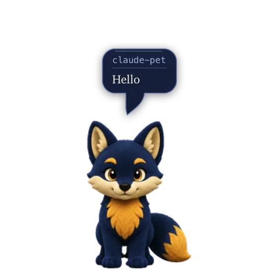

<div align="center">

# claude-pet

**A desktop pet for macOS that reacts to what Claude Code is doing.**

A navy-and-gold fox that sits above your windows, changes pose as Claude works,<br>
and tells you in a speech bubble what it is up to.

[](#install)
[](Package.swift)
[](LICENSE)
[](#how-it-works)



[Install](#install) · [What he does](#what-he-does) · [What he says](#what-he-says) · [Using him](#using-him) · [How it works](#how-it-works)

</div>

## Install

**Requirements:** macOS 13 or later and [Claude Code](https://claude.com/claude-code).

### Download

1. Grab `Claude-Pet.zip` from the [latest release](https://github.com/Dressi123/claude-pet/releases/latest), unzip it, and move **Claude Pet.app** to `/Applications`. The download is built for Apple silicon; on an Intel Mac, build from source.
2. The app is not notarized, so macOS will refuse to open a downloaded copy. Clear the quarantine flag once:
   ```bash
   xattr -dr com.apple.quarantine "/Applications/Claude Pet.app"
   ```
3. Open it, then install the Claude Code hooks from the pet's menu, or with:
   ```bash
   "/Applications/Claude Pet.app/Contents/MacOS/claude-pet" --install-hooks
   ```

### Build from source

Needs a Swift 6 toolchain, which means Xcode or the Command Line Tools.

```bash
git clone https://github.com/Dressi123/claude-pet.git
cd claude-pet
./bundle.sh                                    # builds "~/Applications/Claude Pet.app"
open "$HOME/Applications/Claude Pet.app"
"$HOME/Applications/Claude Pet.app/Contents/MacOS/claude-pet" --install-hooks
```

`bundle.sh` signs the app with the first code-signing identity it finds and falls
back to an ad-hoc signature. Ad-hoc works, but macOS then treats every rebuild as
a new app and asks for permissions again. Pass `SIGN_ID` to choose an identity.

> [!NOTE]
> The installed hook records the absolute path of the helper inside the app, so
> rerun `--install-hooks` after moving the app. `--uninstall-hooks` removes them.
> To start him at login, add Claude Pet under System Settings → General → Login Items.

## What he does

| | Claude Code is doing | The pet |
|:--:|---|---|
|  | nothing | idles, and watches your pointer |
|  | thinking, or running most tools | works |
|  | reading, searching, fetching | inspects |
|  | waiting for you to approve something | asks |
|  | a tool failed | looks sad |
|  | a subagent finished | jumps |
|  | nothing for four minutes | curls up and sleeps |

He also waves when a session starts. Any event wakes him, and so does clicking him.

Several Claude Code sessions can run at once. Each is tracked separately and he
shows whichever most deserves attention: "waiting for you" outranks "busy", which
outranks "idle". The menu bar lists every live session.

## What he says

<p align="center">
  
  &nbsp;&nbsp;&nbsp;&nbsp;
  
</p>

The bubble never shows a tool name. `Bash: Stack the two bubble captures` is a log
line, not a pet, so he speaks in the first person instead.

| Claude is doing   | He says                        |
| ----------------- | ------------------------------ |
| reading a file    | Let me look at Atlas.swift     |
| searching         | Hunting for socketPath         |
| editing           | Tidying up PetView.swift       |
| running a command | Let me run the test suite      |
| asking permission | Claude's own wording, verbatim |
| a tool failed     | That didn't go through         |

While working he **thinks**, in a scalloped cloud. When he is addressing you he
**speaks**, in a balloon with a hooked tail. The border is gold when he needs you,
red when something broke, and blue otherwise.

A header names the session the line came from, so two Claude Code windows are told
apart at a glance. A clock appears once a job passes four seconds, and a line that
stops changing fades after ten.

## Using him

Right-click him for the menu, or use the menu bar icon.

| Menu item | What it does |
| --- | --- |
| **Follow** | Pin him to one session, or "All sessions" to go back. |
| **Watch the pointer** | When idle, he follows the mouse through 16 look directions. |
| **Hop when you hover** | He jumps when the pointer arrives over him. |
| **Follow background sessions** | Headless `claude -p` runs are ignored by default. |
| **Send him away** | He walks off the nearer screen edge, and walks back in when something changes. |
| **Size** | Small, Medium or Large. |
| **Pace** | Lively, Steady, Relaxed or Calm. |
| **Sleep when idle** | After 2, 4 or 10 minutes, or never. |
| **Install / Remove Claude Code hooks** | The same thing `--install-hooks` does. |

Drag him and he runs in the direction he is carried. Clicks land on his outline
rather than the box he is drawn in, so the empty corners pass through to whatever
is underneath.

## Privacy

Only small identifying strings cross the socket: the tool name, the tool's own
`description`, a command, a bare filename. File contents and command output never
leave the hook, and nothing leaves your machine.

## How it works

`--install-hooks` adds a `claude-pet-hook` command to eight events in
`~/.claude/settings.json`. Your existing hooks keep working, and the file is backed
up before every write.

On each event the hook sends a short summary to the app over a Unix datagram
socket and exits. Datagrams never wait for a reader, so Claude Code is not slowed
down when the pet is closed, and the hook always exits 0 so it can never block a
tool call.

<details>
<summary><b>More detail: failures, animation and blinking</b></summary>

<br>

The hooks are `SessionStart`, `UserPromptSubmit`, `PreToolUse`, `PostToolUse`,
`Notification`, `SubagentStop`, `Stop` and `SessionEnd`. The socket lives at
`~/.claude-pet/pet.sock`. A second copy of the app probes it, finds the first one
answering, and quits rather than taking over.

**Failures.** Claude Code emits no `PostToolUse` when a tool fails, so outstanding
`tool_use_id`s are tracked per session and reconciled at turn boundaries. Anything
still unmatched failed. Checking only at boundaries is what keeps parallel tool
calls from looking like failures. A tool that reports `is_error` is caught at once.

**Animation.** Locomotion, waving and jumping run as flipbooks. Working,
inspecting, asking and the sad reaction instead hold one pose for a few seconds
and cut to another at random, because flipping six poses a second reads as frantic
when it lasts for minutes. Each pose is held for at least 0.6 seconds, so a busy
turn does not make him strobe.

**Blinking.** Rows 12 to 17 of the spritesheet are closed-eye twins of the look
directions and the held poses, swapped in for 130ms on a jittered schedule. A pose
without a twin simply does not blink.

</details>

## Make it yours

Want a different character? Replace `pet.json` and `spritesheet.png` in
`Sources/ClaudePet/Resources`. [The current sheet](Sources/ClaudePet/Resources/spritesheet.png)
is 8 columns of 192x208 cells, and the
row layout, the art pipeline and the developer tooling are described in
[docs/DEVELOPMENT.md](docs/DEVELOPMENT.md).

Contributions are welcome. `swift test` runs the suite.

## License

[MIT](LICENSE).

<sub>claude-pet is an independent fan project. It is not affiliated with, endorsed
by, or sponsored by Anthropic. Claude and Claude Code are trademarks of Anthropic,
PBC.</sub>
